# Momo - Self-Hostable AI Memory System

> *"You, my friend, are just a few plumbs short of a fruit pie."* — Momo

Momo is a self-hostable AI memory system written in Rust — inspired by SuperMemory. It provides long-term memory for AI agents using LibSQL's native vector search capabilities — no external vector database required. Single binary, runs anywhere.

## Table of Contents

- [Install](#install)
- [Usage](#usage)
- [Features](#features)
- [Configuration](#configuration)
- [Contradiction Detection](#contradiction-detection)
- [Architecture](#architecture)
- [Supported Embedding Models](#supported-embedding-models)
- [External Embedding Providers](#external-embedding-providers)
- [OCR](#ocr)
- [Audio & Video Transcription](#audio--video-transcription)
- [Changing Embedding Models](#changing-embedding-models)
- [Content Types](#content-types)
- [Docker](#docker)
- [Development](#development)
- [Migration Notes](#migration-notes)
- [API](#api)
- [Maintainers](#maintainers)
- [Contributing](#contributing)
- [Credits](#credits)
- [License](#license)

## Install

### Prerequisites

- **Rust 1.75+** (for building from source)
- **Tesseract** (optional — for OCR on images and scanned PDFs)
- **LLM API key** (optional — for contradiction detection, query rewriting, inference)

### From Source

```bash
git clone https://github.com/watzon/mnemo.git
cd momo
cargo build --release
```

The binary will be at `./target/release/momo`.

### Docker

```bash
docker build -t momo .
docker run -p 3000:3000 -v ./data:/data momo
```

See [Docker](#docker) for the full Dockerfile and configuration.

## Usage

```bash
# Run with defaults (creates momo.db in current directory)
./target/release/momo

# Or with environment variables
DATABASE_URL=file:my-memory.db MOMO_PORT=8080 ./target/release/momo
```

### Add a document

```bash
curl -X POST http://localhost:3000/api/v1/documents \
  -H "Content-Type: application/json" \
  -H "Authorization: Bearer your-api-key" \
  -d '{"content": "https://example.com/article", "containerTag": "user_123"}'
```

### Search documents

```bash
curl -X POST http://localhost:3000/api/v1/search \
  -H "Content-Type: application/json" \
  -H "Authorization: Bearer your-api-key" \
  -d '{"q": "machine learning concepts", "containerTags": ["user_123"], "limit": 10}'
```

### Add a memory

```bash
curl -X POST http://localhost:3000/api/v1/conversations:ingest \
  -H "Content-Type: application/json" \
  -H "Authorization: Bearer your-api-key" \
  -d '{"messages": [{"role": "user", "content": "I prefer dark mode"}], "containerTag": "user_123"}'
```

### Search memories

```bash
curl -X POST http://localhost:3000/api/v1/search \
  -H "Content-Type: application/json" \
  -H "Authorization: Bearer your-api-key" \
  -d '{"q": "user preferences", "containerTags": ["user_123"], "scope": "hybrid"}'
```

## Features

- **Vector Search**: Native LibSQL vector embeddings (no external vector DB needed)
- **Local Embeddings**: Uses FastEmbed with BAAI/bge-small-en-v1.5 (no API calls required)
- **External Embeddings**: Support for OpenAI, OpenRouter, Ollama, and LM Studio APIs
- **Document Processing**: Automatic extraction from URLs, PDFs, HTML, and plain text
- **Memory Versioning**: Track memory updates with parent/child relationships
- **Contradiction Detection**: Automatically detect and resolve conflicting memories
- **Knowledge Graph**: Memory relationships, graph traversal, container-level graphs
- **User Profiling**: Auto-generated user profiles from accumulated memories (requires LLM)
- **Background Inference**: Derives new memories from existing ones via LLM synthesis (opt-in)
- **Episode Decay**: Automatic relevance scoring and forgetting of stale memories
- **Query Rewriting**: LLM-powered query expansion for better search recall (opt-in)
- **LLM Result Filtering**: Post-search relevance filtering via LLM (opt-in)
- **AST-Aware Code Chunking**: Tree-sitter based chunking for Rust, Python, JavaScript, TypeScript, Go, Java, C, C++
- **Office Documents**: DOCX, XLSX, CSV extraction
- **File Upload**: Direct file upload endpoint for documents
- **Container Multi-Tenancy**: Isolate data per container_tag
- **Inspired by Supermemory**: Built with similar concepts but our own unique API design
- **Self-Hostable**: Single binary, SQLite-based, runs anywhere
- **Reranking**: Improved search relevance using cross-encoder models
- **Audio & Video Transcription**: Automatic transcription using local Whisper or OpenAI API

## Configuration

A complete `.env.example` file is included in the repository. Create a `.env` file or set environment variables:

```bash
# Server
MOMO_HOST=0.0.0.0
MOMO_PORT=3000
MOMO_API_KEYS=your-secret-key  # Comma-separated, leave empty for no auth

# Database
DATABASE_URL=file:momo.db  # Local SQLite/LibSQL
# Or use Turso cloud:
# DATABASE_URL=libsql://your-db.turso.io
# DATABASE_AUTH_TOKEN=your-token
# DATABASE_LOCAL_PATH=local-replica.db  # Local replica for remote DB (optional)

# Embeddings (Local)
EMBEDDING_MODEL=BAAI/bge-small-en-v1.5
EMBEDDING_DIMENSIONS=384
# EMBEDDING_BATCH_SIZE=256    # Batch size for embedding generation

# Embeddings (External API)
# EMBEDDING_MODEL=openai/text-embedding-3-small
# EMBEDDING_API_KEY=sk-...
# EMBEDDING_BASE_URL=https://api.openai.com/v1  # Optional, uses provider defaults
# EMBEDDING_TIMEOUT=30        # Request timeout in seconds
# EMBEDDING_MAX_RETRIES=3     # Max retry attempts on failure
# EMBEDDING_RATE_LIMIT=10     # Requests per second (optional)

# Transcription
TRANSCRIPTION_MODEL=local/whisper-small
# TRANSCRIPTION_API_KEY=sk-...
# TRANSCRIPTION_BASE_URL=https://api.openai.com/v1
# TRANSCRIPTION_MODEL_PATH=/path/to/whisper/models  # Local model path (optional)
# TRANSCRIPTION_TIMEOUT=300
# TRANSCRIPTION_MAX_FILE_SIZE=104857600
# TRANSCRIPTION_MAX_DURATION=7200

# Processing
CHUNK_SIZE=512
CHUNK_OVERLAP=50
# MAX_CONTENT_LENGTH=10000000  # Maximum content size in bytes (default: 10MB)

# Memory / Episode Decay / Inference
# EPISODE_DECAY_DAYS=30.0              # Half-life for episode decay
# EPISODE_DECAY_FACTOR=0.9             # Decay multiplier per period
# EPISODE_DECAY_THRESHOLD=0.3          # Below this score, candidate for forgetting (0.0-1.0)
# EPISODE_FORGET_GRACE_DAYS=7          # Grace period before permanent forget
# FORGETTING_CHECK_INTERVAL=3600       # How often to check for items to forget (seconds)
# PROFILE_REFRESH_INTERVAL_SECS=86400  # How often to refresh user profiles (seconds)
# ENABLE_INFERENCES=false              # Enable background inference engine
# INFERENCE_INTERVAL_SECS=86400        # How often to run inference (seconds)
# INFERENCE_CONFIDENCE_THRESHOLD=0.7   # Min confidence for inferred memories
# INFERENCE_MAX_PER_RUN=50             # Max inferences per cycle
# INFERENCE_CANDIDATE_COUNT=5          # Candidate memories to combine
# INFERENCE_SEED_LIMIT=50              # Seed memories to start from
# INFERENCE_EXCLUDE_EPISODES=true      # Exclude episodes from inference

# Reranking (Optional - improves search relevance)
# RERANK_ENABLED=false         # Opt-in, disabled by default (~100ms latency)
# RERANK_MODEL=bge-reranker-base
# RERANK_TOP_K=100             # Number of results to rerank
# RERANK_CACHE_DIR=.fastembed_cache
# RERANK_BATCH_SIZE=64
# RERANK_DOMAIN_MODELS=code:jina-reranker-v1-turbo-en,docs:bge-reranker-v2-m3  # Domain-specific rerankers

# LLM Provider (Optional - for AI-powered features)
# LLM_MODEL=openai/gpt-4o-mini
# LLM_API_KEY=sk-...
# LLM_BASE_URL=https://api.openai.com/v1  # Optional, uses provider defaults
# LLM_TIMEOUT=30               # Request timeout in seconds
# LLM_MAX_RETRIES=3            # Max retry attempts on failure
# ENABLE_CONTRADICTION_DETECTION=false  # Opt-in contradiction detection
# ENABLE_QUERY_REWRITE=false            # LLM-powered query expansion
# QUERY_REWRITE_CACHE_SIZE=1000         # In-memory cache entries for rewrites
# QUERY_REWRITE_TIMEOUT_SECS=2          # Max time for query rewrite
# ENABLE_AUTO_RELATIONS=true             # Auto-detect memory relationships
# DEFAULT_LLM_FILTER_ENABLED=false       # Post-search LLM filtering
# DEFAULT_FILTER_PROMPT=                 # Custom filter prompt template

# Logging
RUST_LOG=momo=info,tower_http=debug
```

## Contradiction Detection

Momo automatically detects and resolves conflicting memories to maintain consistency. When enabled, the system identifies contradictory information and creates version chains.

### How It Works

1. **Heuristic Detection**: Fast pattern matching identifies potential contradictions:
   - Negation patterns: "likes pizza" vs "doesn't like pizza"
   - Antonym pairs: "prefers dark mode" vs "prefers light mode"
   - Value changes: "lives in Seattle" vs "lives in Portland"

2. **LLM Confirmation** (Optional): When an LLM provider is configured, ambiguous cases are confirmed via AI analysis

3. **Automatic Resolution**: When a contradiction is confirmed:
   - Old memory is marked `is_latest = false`
   - New memory is created with `parent_memory_id` linking to old version
   - Memory version is incremented
   - Relationship type `updates` is added

### Configuration

```bash
# Enable contradiction detection (opt-in, disabled by default)
ENABLE_CONTRADICTION_DETECTION=true

# Optional: Configure LLM for enhanced detection
LLM_MODEL=openai/gpt-4o-mini
LLM_API_KEY=sk-...
```

### Example Usage

```bash
# Create initial memory
curl -X POST http://localhost:3000/api/v1/conversations:ingest \
  -H 'Content-Type: application/json' \
  -H "Authorization: Bearer your-api-key" \
  -d '{
    "messages": [{"role": "user", "content": "My favorite color is blue"}],
    "containerTag": "user_123"
  }'

# Create contradictory memory
curl -X POST http://localhost:3000/api/v1/conversations:ingest \
  -H 'Content-Type: application/json' \
  -H "Authorization: Bearer your-api-key" \
  -d '{
    "messages": [{"role": "user", "content": "My favorite color is red"}],
    "containerTag": "user_123"
  }'
```

### Database State

```sql
SELECT id, memory, version, is_latest, parent_memory_id 
FROM memories 
WHERE container_tag = 'user_123';

-- Result:
-- id       | memory                       | version | is_latest | parent_memory_id
-- mem_1    | My favorite color is blue    | 1       | 0         | NULL
-- mem_2    | My favorite color is red     | 2       | 1         | mem_1
```

### Performance

- Heuristic detection: < 1ms per check
- LLM confirmation: ~200-500ms per check (when enabled)
- Database queries optimized with compound index: `(container_tag, is_latest, is_forgotten)`

## Architecture

```mermaid
graph TD
    subgraph MomoServer["Momo Server"]
        subgraph API["API Layer"]
            REST["REST API (v1)<br/>Documents · Memories · Search"]
            Admin["Admin API<br/>(authed)"]
        end
        subgraph Services["Services Layer"]
            SearchSvc["SearchService"]
            MemorySvc["MemoryService"]
            Pipeline["ProcessingPipeline"]
            Forgetting["ForgettingManager"]
            Decay["EpisodeDecay"]
            Profile["ProfileRefresh"]
        end
        subgraph Core["Core Modules"]
            Intelligence["Intelligence<br/>Inference · Contradict · Filter"]
            Processing["Processing<br/>Extract · Chunk · Embed"]
            Embeddings["Embeddings<br/>FastEmbed or API · Reranker"]
        end
        subgraph DB["Database Layer (LibSQL / Turso)"]
            Documents["Documents"]
            Chunks["Chunks"]
            Memories["Memories"]
            Vectors["Vectors"]
            Relationships["Relationships"]
        end
        subgraph Providers["External Providers"]
            OCR["OCR<br/>Tesseract or API"]
            Transcription["Transcription<br/>Whisper or API"]
            LLM["LLM Provider<br/>OpenAI / Ollama /<br/>OpenRouter / Local"]
        end
        REST & Admin --> Services
        Services --> Intelligence & Processing & Embeddings
        Processing --> DB
    end
```



## Supported Embedding Models

### Local Models (FastEmbed)

| Model | Dimensions | Quality | Speed |
|-------|-----------|---------|-------|
| `BAAI/bge-small-en-v1.5` (default) | 384 | Good | Fast |
| `BAAI/bge-base-en-v1.5` | 768 | Better | Medium |
| `BAAI/bge-large-en-v1.5` | 1024 | Best | Slower |
| `all-MiniLM-L6-v2` | 384 | Good | Fast |
| `nomic-embed-text-v1.5` | 768 | Better | Medium |

### External API Models

Use the `provider/model` format to specify external embedding APIs:

| Provider | Example Model | Default Base URL |
|----------|---------------|------------------|
| OpenAI | `openai/text-embedding-3-small` | `https://api.openai.com/v1` |
| OpenRouter | `openrouter/openai/text-embedding-3-small` | `https://openrouter.ai/api/v1` |
| Ollama | `ollama/nomic-embed-text` | `http://localhost:11434/v1` |
| LM Studio | `lmstudio/bge-small-en-v1.5` | `http://localhost:1234/v1` |

## External Embedding Providers

Momo supports any OpenAI-compatible embedding API. Configure via environment variables:

### OpenAI

```bash
EMBEDDING_MODEL=openai/text-embedding-3-small
EMBEDDING_API_KEY=sk-your-openai-key
```

### Ollama (Local)

```bash
EMBEDDING_MODEL=ollama/nomic-embed-text
# No API key needed for local Ollama
```

### LM Studio (Local)

```bash
EMBEDDING_MODEL=lmstudio/bge-small-en-v1.5
# No API key needed for local LM Studio
```

### OpenRouter

```bash
EMBEDDING_MODEL=openrouter/openai/text-embedding-3-small
EMBEDDING_API_KEY=sk-or-your-openrouter-key
```

### Custom Provider

For other OpenAI-compatible APIs, use a custom base URL:

```bash
EMBEDDING_MODEL=openai/your-model-name
EMBEDDING_API_KEY=your-api-key
EMBEDDING_BASE_URL=https://your-provider.com/v1
```

## OCR

Momo can extract text from images and scanned PDFs using OCR. Tesseract is the default local provider, with API alternatives for higher accuracy.

### Supported Image Formats

- JPEG (.jpg, .jpeg)
- PNG (.png)
- WebP (.webp)
- TIFF (.tif, .tiff)
- BMP (.bmp)

**Note:** GIF is not supported.

### OCR Configuration

```bash
# OCR Provider (default: local/tesseract)
OCR_MODEL=local/tesseract          # Local Tesseract
# OCR_MODEL=mistral/pixtral-12b    # Mistral OCR API
# OCR_MODEL=deepseek/deepseek-vl   # DeepSeek OCR API
# OCR_MODEL=openai/gpt-4o          # OpenAI Vision API

# API Configuration (for cloud providers)
OCR_API_KEY=your-api-key
OCR_BASE_URL=https://api.example.com/v1  # Optional, uses provider defaults

# Tesseract Configuration
OCR_LANGUAGES=eng                  # Comma-separated language codes (default: eng)
OCR_TIMEOUT=60                     # Timeout in seconds (default: 60)

# Image Processing Limits
OCR_MAX_DIMENSION=4096             # Max image dimension in pixels (default: 4096)
OCR_MIN_DIMENSION=50               # Min image dimension in pixels (default: 50)
```

### Installing Tesseract

**macOS:**
```bash
brew install tesseract
# For additional languages:
brew install tesseract-lang
```

**Ubuntu/Debian:**
```bash
apt-get install tesseract-ocr tesseract-ocr-eng
# For additional languages:
apt-get install tesseract-ocr-fra tesseract-ocr-deu  # French, German, etc.
```

**Docker:** Tesseract is included in the official Docker image.

### Graceful Degradation

If Tesseract is not installed and no API provider is configured, Momo will:
- Log a warning at startup
- Skip OCR processing for images
- Continue operating normally for all other content types

## Audio & Video Transcription

Momo can transcribe audio and video files using local Whisper models or the OpenAI Whisper API.

### Supported Formats

- **Audio**: MP3, WAV, M4A
- **Video**: MP4, WebM, AVI, MKV

**Note**: YouTube URLs are currently not supported; only uploaded files will be processed.

### Transcription Configuration

```bash
# Transcription Provider (default: local/whisper-small)
TRANSCRIPTION_MODEL=local/whisper-small     # Local Whisper (requires whisper-rs)
# TRANSCRIPTION_MODEL=openai/whisper-1      # OpenAI Whisper API

# API Configuration (for cloud providers)
TRANSCRIPTION_API_KEY=your-api-key
TRANSCRIPTION_BASE_URL=https://api.openai.com/v1

# Local Model Path (Optional)
# TRANSCRIPTION_MODEL_PATH=/path/to/whisper/models

# Processing Limits
TRANSCRIPTION_TIMEOUT=300            # Timeout in seconds (default: 300)
TRANSCRIPTION_MAX_FILE_SIZE=104857600 # Max file size in bytes (default: 100MB)
TRANSCRIPTION_MAX_DURATION=7200       # Max audio duration in seconds (default: 2 hours)
```

### Local vs API Backends

- **Local**: Uses `whisper-rs` for on-device transcription. Requires the model to be specified in `provider/model` format (e.g., `local/whisper-small`).
- **OpenAI**: Uses the OpenAI Whisper API. Set `TRANSCRIPTION_MODEL=openai/whisper-1` and provide your `TRANSCRIPTION_API_KEY`.

## Changing Embedding Models

When you change to a model with different dimensions, Momo detects the mismatch at startup and offers to migrate your data.

### Interactive Migration

```bash
# Start with a different model
EMBEDDING_MODEL=openai/text-embedding-3-small cargo run

# Momo will prompt:
# "Dimension mismatch detected: DB has 384 dims, model has 1536 dims.
#  Re-embed all documents? This will run in the background. [y/N]"
```

### Non-Interactive Migration (CI/Automation)

Use the `--rebuild-embeddings` flag to skip the prompt:

```bash
EMBEDDING_MODEL=openai/text-embedding-3-small cargo run -- --rebuild-embeddings
```

### How Migration Works

1. Momo recreates the chunks table with the new dimension size
2. All documents are marked for re-processing
3. The server starts immediately
4. Re-embedding happens in the background
5. Search works with partial results during migration

## Content Types

Momo automatically extracts content from:
- Plain text
- URLs (webpages)
- PDF documents (including scanned PDFs via OCR)
- Office documents: DOCX (.docx), XLSX (.xlsx), CSV (.csv)
- HTML content
- Markdown files
- Images (JPEG, PNG, WebP, TIFF, BMP) via OCR
- Audio files (MP3, WAV, M4A) via Transcription
- Video files (MP4, WebM, AVI, MKV) via Transcription

## Docker

```dockerfile
FROM rust:1.75-bookworm as builder

WORKDIR /app
COPY . .

RUN cargo build --release

FROM debian:bookworm-slim

RUN apt-get update && \
    apt-get install -y ca-certificates tesseract-ocr tesseract-ocr-eng && \
    rm -rf /var/lib/apt/lists/*

COPY --from=builder /app/target/release/momo /usr/local/bin/momo

ENV MOMO_HOST=0.0.0.0
ENV MOMO_PORT=3000
ENV DATABASE_URL=file:/data/momo.db

EXPOSE 3000

VOLUME ["/data"]

CMD ["momo"]
```

```bash
docker build -t momo .
docker run -p 3000:3000 -v ./data:/data momo
```

## Development

```bash
# Run in development mode
cargo run

# Run with verbose logging
RUST_LOG=momo=debug cargo run

# Build optimized release binary
cargo build --release

# Run tests
cargo test

# Check for issues
cargo clippy

# Format code
cargo fmt

# Docker
docker build -t momo .
docker run -p 3000:3000 -v ./data:/data momo
```

## Migration Notes

### Memory Similarity Scores

In the migration from v4 to v1, memory similarity scores were correctly scaled to reflect the raw vector similarity score (0.0 to 1.0). In previous versions, these scores were incorrectly scaled. If your application logic relied on the previous incorrect scaling, you may need to adjust your thresholds.

## API

### Health Check

```bash
curl http://localhost:3000/api/v1/health
```

### Documents

**Add Document**
```bash
curl -X POST http://localhost:3000/api/v1/documents \
  -H "Content-Type: application/json" \
  -H "Authorization: Bearer your-api-key" \
  -d '{
    "content": "https://example.com/article",
    "containerTag": "user_123",
    "metadata": {"category": "tech"}
  }'
```

**Upload Document File**
```bash
curl -X POST http://localhost:3000/api/v1/documents:upload \
  -H "Authorization: Bearer your-api-key" \
  -F "file=@document.pdf" \
  -F "containerTag=user_123"
```

**Batch Add**
```bash
curl -X POST http://localhost:3000/api/v1/documents:batch \
  -H "Content-Type: application/json" \
  -H "Authorization: Bearer your-api-key" \
  -d '{
    "documents": [
      {"content": "First document..."},
      {"content": "Second document..."}
    ],
    "containerTag": "project_abc"
  }'
```

**Get Document**
```bash
curl http://localhost:3000/api/v1/documents/{documentId} \
  -H "Authorization: Bearer your-api-key"
```

**Update Document**
```bash
curl -X PATCH http://localhost:3000/api/v1/documents/{documentId} \
  -H "Content-Type: application/json" \
  -H "Authorization: Bearer your-api-key" \
  -d '{"metadata": {"category": "updated"}}'
```

**Delete Document**
```bash
curl -X DELETE http://localhost:3000/api/v1/documents/{documentId} \
  -H "Authorization: Bearer your-api-key"
```

**Search Documents**
```bash
curl -X POST http://localhost:3000/api/v1/search \
  -H "Content-Type: application/json" \
  -H "Authorization: Bearer your-api-key" \
  -d '{
    "q": "machine learning concepts",
    "containerTags": ["user_123"],
    "limit": 10,
    "threshold": 0.5,
    "rerank": true
  }'
```

**List Documents**
```bash
curl "http://localhost:3000/api/v1/documents?containerTags=user_123&limit=20" \
  -H "Authorization: Bearer your-api-key"
```

**Get Processing Status**
```bash
curl http://localhost:3000/api/v1/ingestions/{ingestionId} \
  -H "Authorization: Bearer your-api-key"
```

### Memories

**Add Conversation**
```bash
curl -X POST http://localhost:3000/api/v1/conversations:ingest \
  -H "Content-Type: application/json" \
  -H "Authorization: Bearer your-api-key" \
  -d '{
    "messages": [{"role": "user", "content": "I prefer dark mode"}],
    "containerTag": "user_123"
  }'
```

**Search Memories**
```bash
curl -X POST http://localhost:3000/api/v1/search \
  -H "Content-Type: application/json" \
  -H "Authorization: Bearer your-api-key" \
  -d '{
    "q": "user preferences",
    "containerTags": ["user_123"],
    "scope": "hybrid",
    "threshold": 0.6,
    "limit": 10
  }'
```

**Search Scopes** (via the `scope` field)
- `Hybrid` (default): Searches both memories and document chunks. Results are deduplicated.
- `Memories`: Searches only the refined memory layer.
- `Documents`: Searches only document chunks.

**Update Memory**
```bash
curl -X PATCH http://localhost:3000/api/v1/memories/{memoryId} \
  -H "Content-Type: application/json" \
  -H "Authorization: Bearer your-api-key" \
  -d '{
    "content": "User now prefers light mode"
  }'
```

**Forget Memory (by ID)**
```bash
curl -X DELETE http://localhost:3000/api/v1/memories/{memoryId} \
  -H "Authorization: Bearer your-api-key" \
  -d '{"reason": "User changed their mind"}'
```

**Forget Memory (by content)**
```bash
curl -X POST http://localhost:3000/api/v1/memories:forget \
  -H "Content-Type: application/json" \
  -H "Authorization: Bearer your-api-key" \
  -d '{
    "content": "Outdated preference",
    "containerTag": "user_123",
    "reason": "User changed their mind"
  }'
```

**Get User Profile**
```bash
curl -X POST http://localhost:3000/api/v1/profile:compute \
  -H "Content-Type: application/json" \
  -H "Authorization: Bearer your-api-key" \
  -d '{
    "containerTag": "user_123",
    "includeDynamic": true,
    "limit": 50
  }'
```

**Get Memory Graph**
```bash
curl http://localhost:3000/api/v1/memories/{memoryId}/graph \
  -H "Authorization: Bearer your-api-key"
```

**Get Container Graph**
```bash
curl http://localhost:3000/api/v1/containers/{tag}/graph \
  -H "Authorization: Bearer your-api-key"
```

### Admin

All admin endpoints require authentication via `MOMO_API_KEYS`.

**Trigger Forgetting Cycle**
```bash
curl -X POST http://localhost:3000/api/v1/admin/forgetting:run \
  -H "Authorization: Bearer your-api-key"
```

## Maintainers

[@watzon](https://github.com/watzon)

## Contributing

See [CONTRIBUTING.md](CONTRIBUTING.md) for details on how to get involved.

PRs accepted.

## Credits

- Inspired by [Supermemory](https://supermemory.ai)
- Named after Momo, Aang's loyal flying lemur companion 🦇
- Built with [LibSQL](https://libsql.org), [FastEmbed](https://github.com/Anush008/fastembed-rs), and [Axum](https://github.com/tokio-rs/axum)

## License

[MIT](LICENSE) © Momo Contributors
