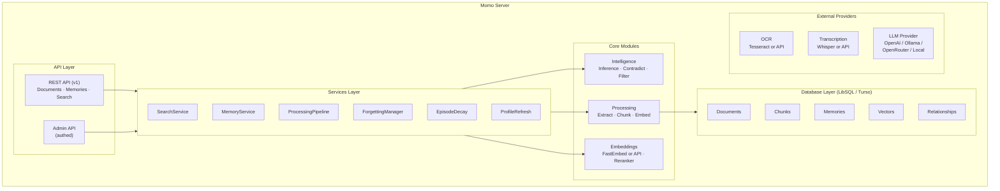

# Self-Hosting Momo

[← Back to README](./README.md)

Momo is a self-hostable AI memory system designed to be a single binary, 100% environment-variable configured solution for personal or organizational memory.

## Table of Contents
1. [Architecture](#architecture)
2. [Prerequisites](#prerequisites)
3. [Installation](#installation)
   - [From Source](#from-source)
   - [Docker](#docker)
4. [Running](#running)
5. [Configuration](#configuration)
   - [Server](#server)
   - [Database](#database)
   - [Embeddings](#embeddings)
   - [Processing](#processing)
   - [Transcription](#transcription)
   - [Memory & Decay](#memory--decay)
   - [Reranking](#reranking)
   - [LLM Provider](#llm-provider)
   - [OCR](#ocr)
   - [Logging](#logging)
6. [Models & Providers](#models--providers)
   - [Local Embedding Models](#local-embedding-models)
   - [External Embedding Providers](#external-embedding-providers)
   - [OCR Providers](#ocr-providers)
   - [Transcription Providers](#transcription-providers)
7. [Features & Management](#features--management)
   - [Content Types](#content-types)
   - [Changing Embedding Models](#changing-embedding-models)
   - [Contradiction Detection](#contradiction-detection)
   - [Graceful Degradation](#graceful-degradation)

---

## Architecture



---

## Prerequisites

- **Rust 1.75+** (if building from source)
- **Tesseract OCR** (optional): For text extraction from images and PDFs.
  - **macOS**: `brew install tesseract`
  - **Ubuntu/Debian**: `sudo apt-get install tesseract-ocr tesseract-ocr-eng`
- **LLM API Key** (optional): Required for advanced features like contradiction detection, query rewriting, and memory inference.

---

## Installation

### From Source

```bash
git clone https://github.com/momomemory/momo.git
cd momo
cargo build --release
```
The compiled binary will be located at `./target/release/momo`.

### Docker

Momo is available as a pre-built image on Docker Hub.

```bash
# Pull and run from Docker Hub
docker run -p 3000:3000 -v ./data:/data momomemory/momo

# Or build locally
docker build -t momo .
docker run -p 3000:3000 -v ./data:/data momo
```

**Note:** The `/data` volume is used to persist the SQLite database.

---

## Running

Momo is configured entirely via environment variables.

```bash
# Running with default settings (creates momo.db in current directory)
./target/release/momo

# Running with custom configuration
DATABASE_URL=file:my-memory.db MOMO_PORT=8080 ./target/release/momo
```

---

## Configuration

Momo follows a `provider/model` string format for external services (Embeddings, LLM, OCR, Transcription).

### Server
| Variable | Description | Default |
|----------|-------------|---------|
| `MOMO_HOST` | Bind address | `0.0.0.0` |
| `MOMO_PORT` | Listen port | `3000` |
| `MOMO_API_KEYS` | Comma-separated API keys for authentication | (None) |

### Database
| Variable | Description | Default |
|----------|-------------|---------|
| `DATABASE_URL` | SQLite/LibSQL path or Turso URL | `file:momo.db` |
| `DATABASE_AUTH_TOKEN` | Auth token for Turso cloud DB | (None) |
| `DATABASE_LOCAL_PATH` | Local replica path for remote DB | (None) |

### Embeddings
**Local (FastEmbed):**
- `EMBEDDING_MODEL`: Model name (default: `BAAI/bge-small-en-v1.5`)
- `EMBEDDING_DIMENSIONS`: Vector dimensions (default: `384`)
- `EMBEDDING_BATCH_SIZE`: Batch size (default: `256`)

**External API:**
- `EMBEDDING_MODEL`: Use `provider/model` (e.g., `openai/text-embedding-3-small`)
- `EMBEDDING_API_KEY`: API key for the provider
- `EMBEDDING_BASE_URL`: Custom base URL
- `EMBEDDING_TIMEOUT`: Request timeout in seconds (default: `30`)
- `EMBEDDING_MAX_RETRIES`: Max retry attempts (default: `3`)
- `EMBEDDING_RATE_LIMIT`: Requests per second (optional)

### Processing
| Variable | Description | Default |
|----------|-------------|---------|
| `CHUNK_SIZE` | Chunk size in tokens | `512` |
| `CHUNK_OVERLAP` | Overlap between chunks | `50` |
| `MAX_CONTENT_LENGTH` | Max content size in bytes | `10000000` (10MB) |

### Transcription
| Variable | Description | Default |
|----------|-------------|---------|
| `TRANSCRIPTION_MODEL` | Model (e.g., `local/whisper-small` or `openai/whisper-1`) | `local/whisper-small` |
| `TRANSCRIPTION_API_KEY` | API key for cloud providers | (None) |
| `TRANSCRIPTION_BASE_URL` | Custom base URL | (None) |
| `TRANSCRIPTION_TIMEOUT` | Timeout in seconds | `300` |
| `TRANSCRIPTION_MAX_FILE_SIZE` | Max file size in bytes | `104857600` (100MB) |
| `TRANSCRIPTION_MAX_DURATION` | Max duration in seconds | `7200` (2h) |

### Memory & Decay
| Variable | Description | Default |
|----------|-------------|---------|
| `EPISODE_DECAY_DAYS` | Half-life for episode decay | `30.0` |
| `EPISODE_DECAY_FACTOR` | Decay multiplier per period | `0.9` |
| `EPISODE_DECAY_THRESHOLD` | Below this, candidates for forgetting | `0.3` (0.0-1.0) |
| `EPISODE_FORGET_GRACE_DAYS` | Grace period before permanent forget | `7` |
| `FORGETTING_CHECK_INTERVAL` | Interval in seconds | `3600` |
| `ENABLE_INFERENCES` | Enable background inference engine | `false` |
| `INFERENCE_INTERVAL_SECS` | Inference run interval | `84600` (24h) |
| `INFERENCE_CONFIDENCE_THRESHOLD`| Min confidence for inferred memories | `0.7` |
| `INFERENCE_MAX_PER_RUN` | Max inferences per cycle | `50` |

### Reranking
- `RERANK_ENABLED`: Enable reranking (opt-in) (default: `false`)
- `RERANK_MODEL`: Reranker model (default: `bge-reranker-base`)
- `RERANK_TOP_K`: Number of results to rerank (default: `100`)

### LLM Provider
- `LLM_MODEL`: Model (format: `provider/model`, e.g., `openai/gpt-4o-mini`)
- `LLM_API_KEY`: API key
- `ENABLE_CONTRADICTION_DETECTION`: Enable contradiction logic (default: `false`)
- `ENABLE_QUERY_REWRITE`: Enable query expansion (default: `false`)
- `ENABLE_AUTO_RELATIONS`: Auto-detect relationships (default: `true`)

### OCR
- `OCR_MODEL`: OCR provider (default: `local/tesseract`)
- `OCR_LANGUAGES`: Comma-separated language codes (default: `eng`)
- `OCR_MAX_DIMENSION`: Max image dimension (default: `4096`)

### Logging
- `RUST_LOG`: Logging level (default: `momo=info,tower_http=debug`)

---

## Models & Providers

### Local Embedding Models (FastEmbed)
| Model | Dimensions | Quality | Speed |
|-------|-----------|---------|-------|
| `BAAI/bge-small-en-v1.5` (default) | 384 | Good | Fast |
| `BAAI/bge-base-en-v1.5` | 768 | Better | Medium |
| `BAAI/bge-large-en-v1.5` | 1024 | Best | Slower |
| `all-MiniLM-L6-v2` | 384 | Good | Fast |
| `nomic-embed-text-v1.5` | 768 | Better | Medium |

### External Embedding Providers
| Provider | Example Model | Default Base URL |
|----------|---------------|------------------|
| OpenAI | `openai/text-embedding-3-small` | `https://api.openai.com/v1` |
| OpenRouter | `openrouter/openai/text-embedding-3-small` | `https://openrouter.ai/api/v1` |
| Ollama | `ollama/nomic-embed-text` | `http://localhost:11434/v1` |
| LM Studio | `lmstudio/bge-small-en-v1.5` | `http://localhost:1234/v1` |

### OCR Providers
- `local/tesseract`: Local Tesseract (default)
- `mistral/pixtral-12b`: Mistral OCR API
- `deepseek/deepseek-vl`: DeepSeek OCR API
- `openai/gpt-4o`: OpenAI Vision API

### Transcription Providers
- `local/whisper-small`: Local Whisper (default)
- `openai/whisper-1`: OpenAI Whisper API

---

## Features & Management

### Content Types
Momo automatically detects and processes:
- **Text**: Plain text, Markdown, HTML.
- **Documents**: PDF, DOCX, XLSX, CSV.
- **Web**: URLs (scrapes page content).
- **Images**: JPEG, PNG, WebP, TIFF, BMP (via OCR).
- **Media**: Audio (MP3, WAV, M4A) and Video (MP4, WebM, AVI, MKV) via Transcription.

### Changing Embedding Models
If you change your embedding model, Momo will detect a dimension mismatch at startup.
- **Interactive**: You will be prompted to re-embed your data.
- **Non-interactive**: Use the `--rebuild-embeddings` flag.
Migration runs in the background; search continues to function with partial results.

### Contradiction Detection
Momo can detect when new information contradicts existing memories.
- **Heuristic**: Immediate detection via negation and value changes (<1ms).
- **LLM Confirmation**: Optional refinement (~200-500ms).
- **Resolution**: Old memories are marked as "not latest" and linked to the new entry.
- **Required**: Set `ENABLE_CONTRADICTION_DETECTION=true`.

### Graceful Degradation
Momo is designed to be functional even without external dependencies:
- **No LLM**: Search and storage work, but advanced features (inference, rewrites) are disabled.
- **No Tesseract**: Image processing will fail, but text documents work.
- **No Whisper**: Audio/Video processing will fail, but other ingestion works.

---

For detailed API information, see [API Reference](./api.md).
